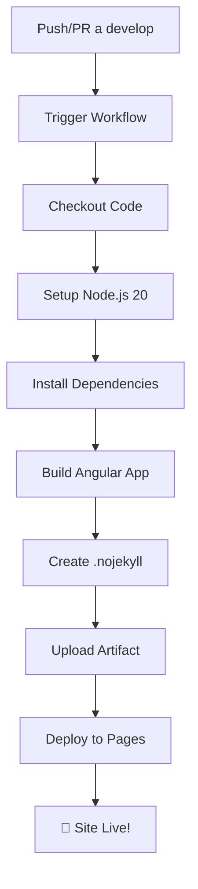

# 🚀 GitHub Actions Workflow

Este directorio contiene el workflow de GitHub Actions para el despliegue automático del portafolio Angular a GitHub Pages.

## 📁 Estructura

```
.github/
├── workflows/
│   └── deploy.yml          # Workflow principal de despliegue
└── README.md              # Este archivo
```

## ⚙️ Workflow: deploy.yml

### 🔄 Triggers
- **Push** a la rama `develop`
- **Pull Request** hacia la rama `develop`

### 🛠️ Jobs

#### 1. Build Job
- ✅ Checkout del código
- ✅ Setup de Node.js 20
- ✅ Cache de dependencias npm
- ✅ Instalación de dependencias (`npm ci`)
- ✅ Configuración de GitHub Pages
- ✅ Build de Angular con `--base-href "/Portafolio/"`
- ✅ Creación automática de `.nojekyll`
- ✅ Upload del artifact para deployment

#### 2. Deploy Job
- ✅ Deployment automático a GitHub Pages
- ✅ URL disponible en los outputs del workflow

### 🔐 Permisos
- `contents: read` - Leer el repositorio
- `pages: write` - Escribir en GitHub Pages
- `id-token: write` - Token para deployment

### 🌐 Environment
- **Nombre**: `github-pages`
- **URL**: Se genera automáticamente

## 🎯 Flujo Completo



## 📊 Monitoreo

### Ver Workflows Activos
1. Ve a la pestaña **Actions** del repositorio
2. Selecciona "Deploy Angular to GitHub Pages"
3. Ve el historial de deployments

### Estados Posibles
- 🟡 **En progreso**: El workflow está ejecutándose
- ✅ **Exitoso**: Deployment completado correctamente
- ❌ **Fallido**: Error en el proceso (revisa logs)

## 🔧 Troubleshooting

### ❌ Build Fails
**Síntomas**: El job "build" falla
**Soluciones**:
- Verifica que `package.json` sea válido
- Asegúrate de que no hay errores de TypeScript
- Revisa las dependencias en `package-lock.json`

### ❌ Deploy Fails
**Síntomas**: El job "deploy" falla
**Soluciones**:
- Verifica que GitHub Pages esté configurado correctamente
- Asegúrate de que el repositorio tenga permisos de Pages
- Revisa que la rama sea accesible

### 🐌 Deployment Lento
**Síntomas**: El deployment tarda más de lo normal
**Causa**: GitHub Actions puede tener alta demanda
**Solución**: Esperar, normalmente se resuelve solo

## 📈 Optimizaciones Futuras

### Posibles Mejoras
- [ ] Cache más agresivo de `node_modules`
- [ ] Tests automáticos antes del deploy
- [ ] Notificaciones de Slack/Discord
- [ ] Deploy a staging environment
- [ ] Análisis de bundle size

### Variables de Entorno
Si necesitas agregar variables:

```yaml
env:
  NODE_ENV: production
  CUSTOM_VAR: ${{ secrets.CUSTOM_VAR }}
```

## 🔗 Referencias

- [GitHub Actions Docs](https://docs.github.com/en/actions)
- [GitHub Pages Docs](https://docs.github.com/en/pages)
- [actions/checkout](https://github.com/actions/checkout)
- [actions/setup-node](https://github.com/actions/setup-node)
- [actions/configure-pages](https://github.com/actions/configure-pages)
- [actions/upload-pages-artifact](https://github.com/actions/upload-pages-artifact)
- [actions/deploy-pages](https://github.com/actions/deploy-pages) 